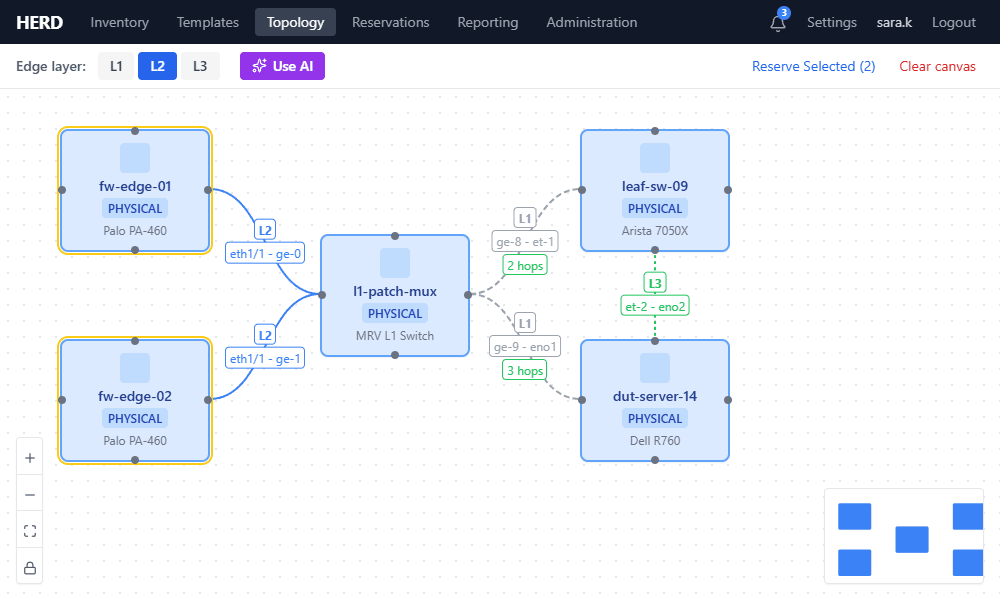
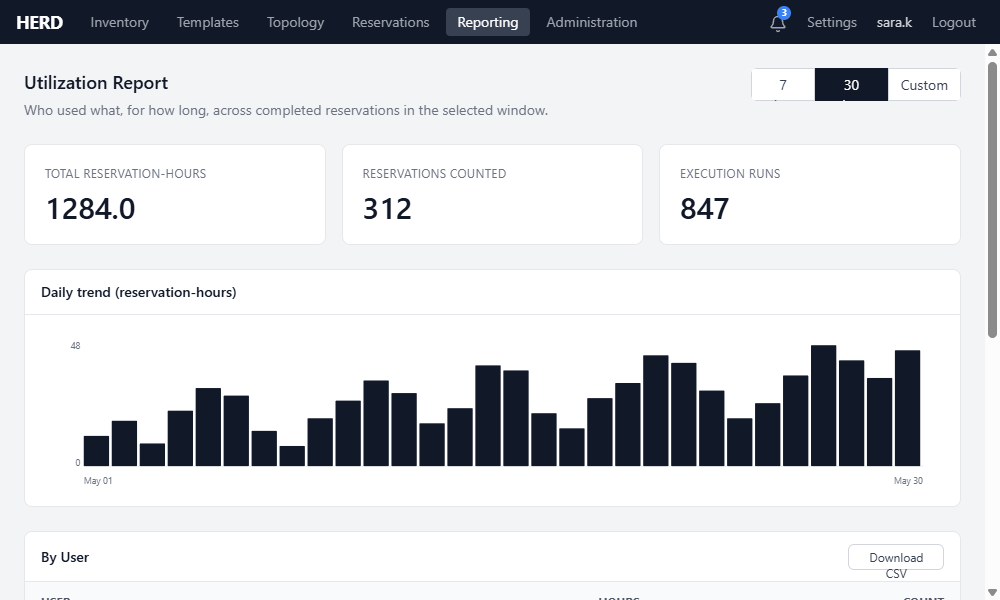
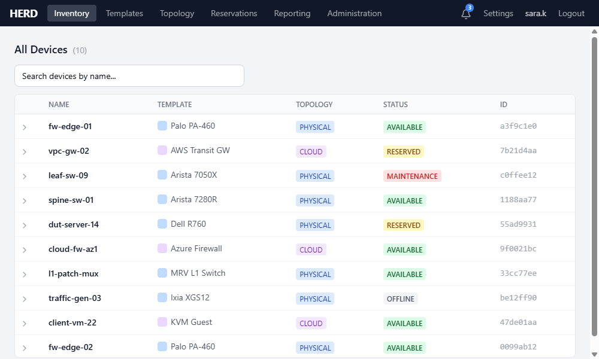
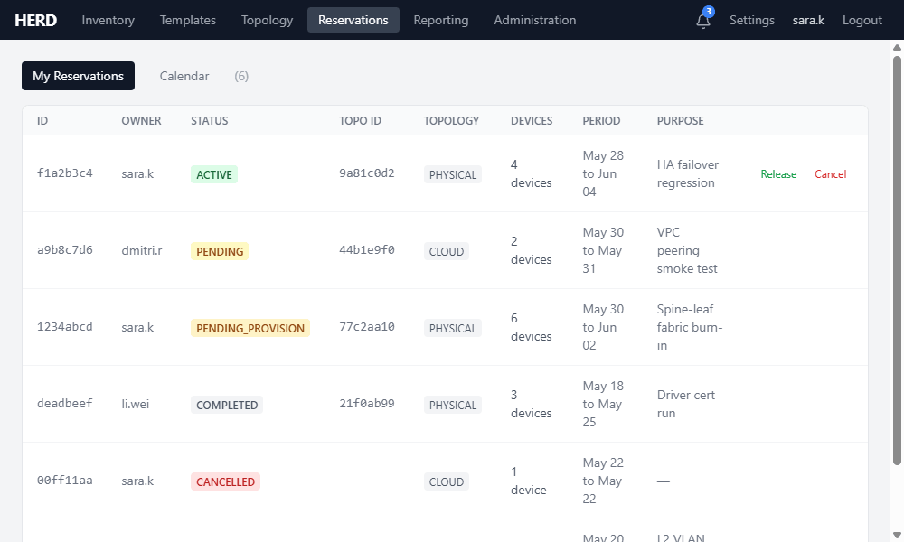
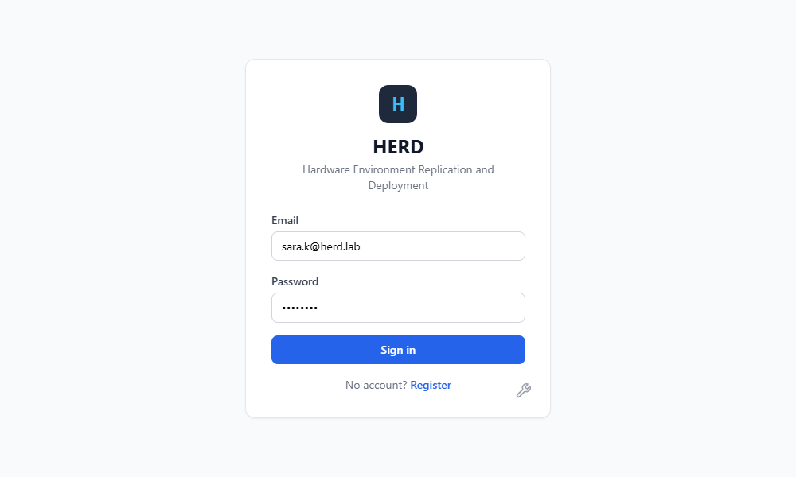
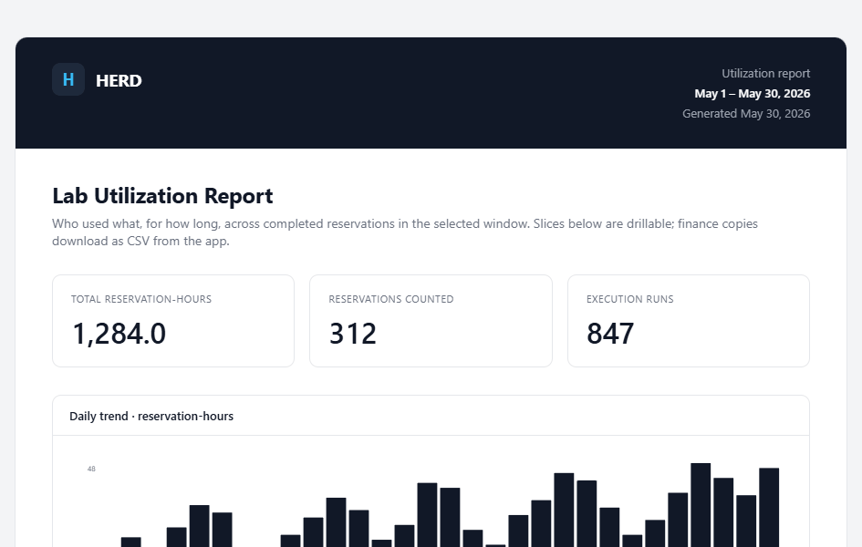

# HERD: Hardware Environment Replication and Deployment

A lab reservation and topology management platform built lab-first, not built from a ticketing or asset-management tool.

## New here? Start with the [User Manual](https://vendrabuck.github.io/HERD/manual/)

## Why HERD exists

Every lab-running organization hits the same two questions and cannot answer them:

1. **"Do we have a lab? How do I use it?"** Engineers lose days looking for equipment, tracking down who owns a rack, and waiting on informal approvals. The answer is usually a spreadsheet or a Confluence page that does not scale past one team.
2. **"What was done in the lab, by whom, on what, for how long?"** Finance cannot defend lab budget at planning cycle. Leadership cannot justify new capex. The lab is a black hole.

HERD is the front door for both questions. Any employee can browse the inventory, build a topology, reserve equipment, and use it without tribal knowledge. Leadership gets utilization reporting (by user, device, topology type, day, and group) with CSV export so the budget conversation has data behind it.

The differentiator is the **AI topology pipeline**: a user describes what they need (in plain language, optionally with a support case PDF or test specification attached), the LLM proposes a valid wiring plan against live inventory with role-based device selection, and a human reviews ghost nodes on the canvas before anything is committed. Accept and the orchestrator transactionally creates the topology, books the reservation, and (optionally) pushes per-device configurations through the execution service. End-to-end, requirements to configured working lab, with a human checkpoint and full rollback.

Industry classification: **inventory control, automation, and work efficiency**. HERD is not a security product.

For the architecture trade-offs accepted in the design, see [docs/ARCHITECTURE.md](docs/ARCHITECTURE.md).

## Screenshots

The images below are design-system mockups rendered from the HERD UI kit, not captures of a live stack; they show the intended look of each surface.



*Topology editor: drag-and-drop devices, L1/L2/L3 edges colored by layer, pathfinding hop counts, and the "Use AI" entry point. Design-system mockup.*



*Utilization reporting: reservation-hours headline stats, daily trend, and per-user/device/group/template breakdowns with CSV export. Design-system mockup.*

| Inventory | Reservations | Sign-in |
|---|---|---|
|  |  |  |

*Inventory, reservations, and sign-in. Design-system mockups.*



*The printable utilization report: the finance-facing deliverable that leadership uses to defend lab budget. Design-system mockup.*

## What it does

- Define device and port templates with custom fields (string, number, boolean, dropdown, password) and per-field defaults
- Browse and reserve networking lab equipment from physical labs or cloud environments
- Mark templates as exclusive (single reservation) or non-exclusive (shared infrastructure like switches)
- Build network topologies via drag-and-drop, connecting devices at Layer 1/2/3
- Enforce physical/cloud topology separation; physical and cloud devices cannot be mixed in a single topology
- Upload driver packages with connection types (Management, Layer 1/2/3 Switch) to classify devices as DUT or infrastructure
- Automatic L1 switch port connections and L2 VLAN provisioning when reservations are created, with automatic teardown on cancellation or completion
- Shortest-path cable routing through L1 switch infrastructure with visual feedback on the topology canvas
- Reservation detail view with device inventory, hop-by-hop route visualization, schedule editing, and live device list modification
- Automatic reservation expiration: pending reservations activate, active reservations complete on schedule
- Gantt-style reservation calendar with day, week, and month views
- Utilization reporting dashboard (by user, device, topology type, day, and group) with CSV export, plus a fleet utilization section: per-device utilization rate against the full window, idle-device view, and fleet-wide summary
- AI-assisted topology generation (feature-gated by a configured LLM provider; ships with Anthropic and OpenAI-compatible backends, the latter covers vLLM, Ollama, LM Studio, OpenAI, and Azure OpenAI): natural-language prompts + optional file attachments propose a topology rendered as ghost nodes with Accept/Modify/Reject human-in-the-loop review
- AI-assisted recipe authoring (dark by default behind `AI_RECIPE_AUTHORING_ENABLED`): an admin describes a dynamic-resource recipe in plain language, the AI drafts the driver package, the execution sandbox validates it (structure, policy, simulated dry-run) with bounded auto-repair, and a review panel gates the explicit admin approval that uploads it (see [docs/AI_RECIPES.md](docs/AI_RECIPES.md))
- Device group visibility controls: non-admin users only see devices in their assigned groups
- Local or LDAP/Active Directory authentication (pluggable via `AUTH_METHOD`); LDAP users JIT-provision in HERD on first bind
- Per-user preferences (saved filters, page sizes, notification settings) with a Settings page under the user menu
- Notifications driven by durable NATS consumers on reservation lifecycle and device-health events, with an in-app bell + unread badge plus opt-in email, chat, and outbound-webhook channels (HMAC-signed), an upcoming-expiry reminder, and per-channel and per-event opt-outs
- Save and load topology canvases for persistent lab diagrams; every save is versioned with preview, diff, and restore (restore is blocked while an active reservation references the topology)
- Bulk import and export of devices, templates, and topologies as CSV or JSON, with a dry-run preview, per-row error reporting, and cross-instance reference resolution by name (see [docs/BULK_IMPORT_EXPORT.md](docs/BULK_IMPORT_EXPORT.md))
- Paginated list views across all resources
- Structured JSON logging across all services with configurable log levels
- Port cable validation in the topology editor with visual indicators for uncabled ports

## Architecture

The React frontend talks to Traefik, which terminates TLS and routes each `/api/<service>`
prefix to an independent FastAPI service. Every service owns its own PostgreSQL 16 schema
(no cross-schema joins); reservation lifecycle and device-health events flow asynchronously
over NATS JetStream.

| Service | Responsibility |
|---|---|
| Config | System configuration UI (no database, standalone) |
| Auth | JWT auth (local or LDAP/AD), RBAC, user/group management |
| Inventory | Device templates, devices, ports, drivers, device groups |
| Reservations | Conflict detection, topology enforcement, auto-expiration |
| Cabling | Connections, topology persistence, pathfinding |
| ACL | Resource-level grants (device, topology, reservation, secret) |
| Execution | Driver execution sandbox, NATS event consumer (DLQ) |
| AI Orchestrator | LLM-driven topology generation, reservation assistant, and recipe drafting (configurable: Anthropic or OpenAI-compatible) |
| User Profile | Per-user preferences (saved filters, page sizes, extras) |
| Notifications | NATS consumer + in-app notifications + per-user prefs |
| Integration | Versioned `/api/v1` reservation facade + outbound webhooks (NATS consumer) |
| Secrets | Encrypted-at-rest credential store, ACL-gated, envelope encryption under an env-supplied KEK |

Shared data layer: PostgreSQL 16 (schema-per-service) and NATS JetStream (async events).

## Tech Stack

| Layer | Technology |
|---|---|
| Backend services | Python 3.12, FastAPI, SQLAlchemy 2.x (async), Alembic |
| Package manager | `uv` with workspace support |
| Database | PostgreSQL 16 (schema-per-service) |
| Async events | NATS JetStream |
| Gateway / TLS | Traefik v3 (TLS termination with custom PKI chain) |
| Object storage | Local filesystem (default) or MinIO (S3-compatible, optional) for driver packages |
| Frontend | React 19, TypeScript, Vite |
| Topology editor | React Flow (@xyflow/react) |
| State management | Zustand, TanStack Query |
| UI | Tailwind CSS 4, shadcn/ui |
| Auth | Custom JWT service (bcrypt, python-jose) |

## Roles

HERD has three roles: **user**, **admin**, and **superadmin**.

| Role | What they can do |
|---|---|
| User | Browse inventory and templates, build topologies, create and manage own reservations |
| Admin | Everything a user can do, plus manage templates, devices, ports, drivers, connections, user groups, and device groups |
| Superadmin | Everything an admin can do, plus list all users and promote or demote users (user to admin) |

See [docs/ROLES.md](docs/ROLES.md) for the full reference including API endpoints by role
and instructions for creating the superadmin account.

## Quickstart

### Prerequisites

- Docker + Docker Compose
- `uv` (Python package manager)
- Node.js 22+ (for local frontend development)

### Run the full stack

**Option A: Configure via the web UI (recommended)**

```bash
cp .env.example .env

# Set these five values in .env before the first `make up`:
#   POSTGRES_USER, POSTGRES_PASSWORD, POSTGRES_DB
#   AUTH_SECRET_KEY, INTERNAL_API_TOKEN  (generate each with: openssl rand -hex 32)
# docker-compose injects them into the containers at creation time. The config
# UI shows these fields; a UI save outranks the env for the app services that
# "Save and Restart" restarts, but postgres itself is never restarted by it,
# so change the POSTGRES_* values only via .env plus a full recreate.

make up        # dev mode: hot-reload + volume mounts

# Open https://localhost, click the wrench icon on the login page,
# log in with the config password (set CONFIG_ADMIN_PASSWORD, or read the
# one-time password from `make logs config`), change it, fill out all
# required fields, and click "Save and Restart".
```

**Option B: Configure via .env file**

```bash
cp .env.example .env

# Set the superadmin credentials in .env before first startup:
#   SUPERADMIN_EMAIL, SUPERADMIN_USERNAME, SUPERADMIN_PASSWORD
# Also set the compose-time values before first `make up`, as in Option A:
#   POSTGRES_USER, POSTGRES_PASSWORD, POSTGRES_DB, AUTH_SECRET_KEY, INTERNAL_API_TOKEN
# AUTH_SECRET_KEY is required; services fail without it
# LOG_LEVEL controls logging verbosity (DEBUG, INFO, WARNING, ERROR, CRITICAL; default: INFO)

make up        # dev mode: hot-reload + volume mounts
make prod      # production: no reload, no volume mounts

# View logs
make logs
```

The app is available at `https://localhost` (HTTP redirects to HTTPS).
Values saved through the config UI take precedence over `.env`; a `config.json`
that exists only from first-run auto-bootstrap does not (see `docs/ENV_VARS.md`).

### API Endpoints

| Service | Base Path |
|---|---|
| Config | `/api/config` |
| Auth | `/api/auth` |
| Inventory | `/api/inventory` |
| Reservations | `/api/reservations` |
| Cabling | `/api/cabling` |
| ACL | `/api/acl` |
| Execution | `/api/execution` |
| AI Orchestrator | `/api/ai` |
| User Profile | `/api/user-profile` |
| Notifications | `/api/notifications` |
| Integration | `/api/v1` |
| Secrets | `/api/secrets` |

### Development commands

```bash
make up              # Start full stack (dev mode)
make down            # Stop full stack
make build           # Rebuild all images
make test            # Run all backend tests (13 services)
make test-frontend   # Run frontend tests (vitest)
make test-e2e        # Run E2E browser tests (Selenium + Playwright, requires running stack)
make coverage        # Run all backend tests with coverage report
make lint            # ruff check + eslint
make format          # ruff format + ruff check --fix
make master          # Full validation: lint + unit + frontend + build + live LDAP + ephemeral stack + integration + e2e (no coverage)
make master-clean    # Same as master, but wipes herd-* images first and forces a no-cache rebuild
make everything      # Same surface as master plus: format-check (no mutate), backend + frontend coverage, seed, headless locust load; on success the seeded gate stack is left running (make gate-down to stop)
make migrate         # Run Alembic migrations
make logs            # Tail logs
make frontend-dev    # Run frontend dev server
```

## Key Features

### Device template system
- User-defined templates replace hardcoded device types
- Two template types: "device" and "port"
- Templates define custom field sections with typed fields (string, number, boolean, dropdown, password)
- Fields support optional default values, validated to match declared type
- Devices and ports reference a template and store field data as JSON

### Device ports
- Ports are children of devices, typed by port templates
- Full CRUD including bulk creation
- Deleting a device cascades to its ports

### Exclusive vs non-exclusive reservations
- Templates have an `exclusive` flag (default: true)
- Exclusive devices: single reservation at a time, conflict detection enforced, status toggled on reserve/release
- Non-exclusive devices (shared infrastructure): skip conflict detection, multiple concurrent reservations allowed, status unchanged

### Driver packages
- Device templates reference a driver package via `driver_id`; port templates do not use drivers
- Standalone driver entities with name, description, connection_type, and file metadata
- connection_type classifies devices: "Management" = DUT (visible to all users), "Layer 1/2/3 Switch" = infrastructure (admin-only)
- Stored on local filesystem by default (`/data/drivers`); MinIO (S3-compatible) used when configured
- Upload validation: .zip or .tar.gz, max 10 MB

### Device groups and visibility
- Device groups control which devices non-admin users can see and reserve
- User groups are assigned permissions on device groups
- Admins see all devices; regular users see only devices in their assigned groups
- "No Pool" default group: new devices are auto-assigned on creation

### User groups
- Organize users into teams with full CRUD and bulk member management
- "Not Grouped" default group: new users are auto-assigned on registration
- Used by device groups and ACL service for permission resolution

### Reservation detail and live editing
- Reservation detail modal with five tabs: Details, Inventory, Routes, Schedule, and a
  conditional AI Assistant tab (shown only when an AI provider is configured)
- Inventory tab: expandable device rows with ports and connection information
- Routes tab: hop-by-hop pathfinding visualization between all DUT pairs in the reservation
- Schedule tab: inline editing of end time and purpose
- Edit Resources: search, add, and remove devices with availability filtering
- Backend PATCH endpoint validates topology uniformity, checks conflicts for added devices, and publishes NATS events for driver execution
- Edit topology (live-edit mode): while a reservation is ACTIVE its owner (or an admin) re-wires the reservation's editable topology fork; edits autosave as drafts and committing reconciles the fork (release-before-build) and leaves the master topology's history untouched. A commit that would claim a port held by another active reservation is refused with a conflict naming the blocker. After the reservation ends the fork is a read-only as-built record (ADR 0006)

### Reservation calendar
- Gantt-style timeline with day, week, and month views
- Cross-user visibility with status filters
- Click-to-view reservation details with cancel/release actions

### Pathfinding
- On-demand BFS shortest-path computation through L1 switch infrastructure (uniform-weight graph, so breadth-first yields a minimum-hop path)
- Fires automatically when L1 connections are drawn in the topology editor
- L1 edges show green stroke with hop count badge when a path exists, red stroke with "no path" badge otherwise
- Batch pathfinding for reservation routes tab: visualizes all DUT-to-DUT paths through the switch fabric

### Port cable validation
- Topology editor validates whether selected ports have physical cables before creating connections
- Uncabled ports shown with a quiet "no cable" tag in the wiring dialog's port columns
- Edges with uncabled ports render red stroke with "uncabled port" badge

### Topology editor
- Drag-and-drop device placement with floating equipment palette
- Equipment palette filters: search, template, topology type, and reserved resource visibility toggle
- Devices on canvas are hidden from the palette; removing restores them
- Drawing a connection opens a wiring dialog (two port columns, drag or click-to-connect, per-line L1/L2/L3, "Connect 1:1 in order" for wiring two same-size switches at once); a Quick connect toggle swaps in a compact single-pair popover, with an escalation link back to the full dialog
- Connections between the same device pair collapse into one bundled edge on the canvas with a count badge and per-connection delete
- Physical/cloud topology separation enforced at database, service, and UI levels

### Device health monitoring
- Per-device opt-in via `poll_interval_seconds` on the device or its template (minimum 30s)
- Execution-service asyncio scheduler polls each opted-in device on its cadence via the existing `login`/`status`/`logout` driver sequence
- Snapshot states: HEALTHY, DEGRADED, UNREACHABLE, UNKNOWN; rendered as a colored badge on the device detail page
- Failures past `HEALTH_POLL_MAX_CONSECUTIVE_FAILURES` (default 3) trigger exponential backoff with jitter so unreachable devices do not flood the audit log
- Threshold crossings publish a `device.health_transition` NATS event; notifications fan out to admins + active reservation holders; emit-on-Nth-failure dedupe means flapping devices generate no notifications
- Fleet-scale bounds: `HEALTH_POLL_BATCH_SIZE` (default 10) caps rows claimed per tick, `HEALTH_POLL_MAX_CONCURRENCY` (default 1) caps concurrent driver polls; devices carry a persisted poll tier (idle/in-use) driven by reservation lifecycle events, with optional per-tier interval overrides
- `EXECUTION_POLLER_ONLY=true` runs a replica as background-only (health scheduler, NATS consumer, outbox relay), pairable with `HEALTH_POLL_SCHEDULER_ENABLED=false` API replicas to scale a poller fleet separately

### Pagination
- All list endpoints return paginated responses with total count
- Default limit: 50 (max: 500)
- Frontend pagination component auto-hidden when all items fit on one page

### Structured logging
- All services emit JSON-formatted log output
- Log level configurable per service via `LOG_LEVEL` env var (default: INFO)
- Request logging middleware: method, path, status code, duration for every request
- Business event logging: login/register, role changes, device CRUD, reservation lifecycle, group membership changes

### TLS / HTTPS
- Traefik terminates TLS with a custom PKI chain (Root CA, Intermediate CA, Server cert)
- Port 80 redirects to HTTPS on port 443
- Install `infra/traefik/certs/root-ca.crt` as a trusted root CA on client machines

## Service Details

### Config Service
Standalone configuration UI with zero database dependency. Stores settings as JSON files
on a shared Docker volume. Password-protected with its own authentication (set
`CONFIG_ADMIN_PASSWORD`, or a random one-time password is generated and logged on first
boot and must be changed before the write surface unlocks). All environment variables from `.env.example`
are exposed as configurable fields. On first startup with no config, login is blocked
until the admin completes setup via the wrench icon on the login page. After saving,
the service restarts this compose project's HERD services via the Docker API
(config, traefik, postgres, nats, and the frontend are skipped, and other compose
projects on the host are never touched). All other services read the config file via
a shared Pydantic settings source in herd-common; values saved through the UI take
precedence over env vars, while an auto-bootstrapped config file stays subordinate
to them, so pure-.env operation is unchanged until the first UI save.

### Auth Service
Registration, login, JWT issuance, refresh token rotation, logout, superadmin
user management, and user groups with bulk membership management. Default "Not Grouped"
group seeded on startup. Credential verification is pluggable via `AUTH_METHOD`:
`local` (default, bcrypt) or `ldap` (bind against a directory server; users JIT-provision
in HERD on first successful bind with `auth_source='ldap'`). Superadmin rows remain
local-only regardless of `AUTH_METHOD`. See [docs/ENV_VARS.md](docs/ENV_VARS.md) for the
full LDAP knob set.

### Inventory Service
Device templates, devices, ports, driver packages, and device groups with permission-based
visibility. Template and device CRUD with field validation. Device search by name
(case-insensitive partial match). Reads available to all authenticated users (non-admin
users filtered by device group visibility); writes require admin or superadmin role.

### Reservations Service
Time-window reservations with topology-type enforcement (physical and cloud devices
cannot be mixed), conflict detection for exclusive devices, automatic expiration of
pending and active reservations, and inter-service device status sync. Live editing
of active reservations: modify device lists, extend end times, update purpose, and
re-wire the reservation's editable topology fork (reconciled on save, frozen to an
as-built record at teardown; ADR 0006).
Publishes lifecycle events to NATS JetStream (`herd.reservations.*`) for created,
cancelled, completed, and updated events.

### Cabling Service
Connection persistence (PostgreSQL-backed) between device ports and topology canvas
persistence. On-demand BFS shortest-path computation through L1 switch
infrastructure for cable route visualization. Connections can be filtered by device ID.
Reads available to all authenticated users; writes require admin or superadmin role.

### ACL Service
Resource-level access control via group-based grants for devices, topologies,
reservations, and secrets (`resource_type` one of `device`, `topology`, `reservation`,
`secret`; permission `view` or `manage`, with `manage` implying `view`). Device
visibility for non-admin users is primarily handled by device groups in the inventory
service; ACL device grants layer narrower per-device carve-outs on top (for example,
non-admin manual driver execution and the reservation-owner widening on device-config
writes).

### Execution Service
Runs user-authored Python driver code on infrastructure devices at reservation lifecycle
events. Driver packages (uploaded to inventory as .zip or .tar.gz) are downloaded,
cached locally with SHA256 invalidation, validated for required methods, and executed in
a sandboxed subprocess with configurable timeouts.

Device context (credentials, metadata, field data) is passed to drivers via a temporary
JSON file and as uppercase `HERD_`-prefixed environment variables (e.g. `HERD_IP`,
`HERD_LOGIN`) for debugging and observability. Type conversion: strings pass through,
numbers and booleans are stringified, None becomes empty string, complex types become
JSON.

A NATS consumer listens for reservation lifecycle events and triggers:
- **L1 switch operations**: connect/disconnect port pairs, grouped per switch for batched login/logout sessions
- **L2 VLAN provisioning**: derive VLAN ID from reservation UUID, create VLAN, add ports on reservation creation; remove ports and delete VLAN on cancellation/completion

A periodic health-poll scheduler runs each opted-in device through the same
`login`/`status`/`logout` sequence on its configured `poll_interval_seconds` cadence.
Outcomes drop into a per-device `device_health_status` snapshot (HEALTHY, DEGRADED,
UNREACHABLE, UNKNOWN) and history persists in `execution_runs`. On a status transition
(failures crossing the threshold, or recovery to zero failures) the scheduler publishes
a `device.health_transition` event to the `HERD_HEALTH` NATS stream for the
notifications service to fan out as in-app alerts.

All executions are recorded as audit-trail runs with status, output, errors, and timing.
See [docs/DRIVERS.md](docs/DRIVERS.md) for the driver developer guide and interface
contracts.

### AI Orchestrator Service
LLM-driven topology generator: a user-supplied prompt (plus optional PDFs, tech-support
tarballs, or plain-text files) is sent to the configured LLM provider with a strict JSON
tool schema. Two backends ship: `AI_PROVIDER=anthropic` (AsyncAnthropic SDK against
Anthropic's API) and `AI_PROVIDER=openai_compat` (AsyncOpenAI SDK against any compatible
chat-completions endpoint, including vLLM, Ollama, LM Studio, OpenAI proper, and Azure
OpenAI). The model returns role-based device proposals and edges; the orchestrator
resolves roles against live inventory (respecting device-group visibility), previews the
result as ghost nodes on the canvas, and commits topology + reservation only after the
user clicks Accept. Optional `apply_configs` step calls the execution service to push
LLM-generated device configurations. Feature-gated: when the active provider is not
configured the AI endpoints return 503 and the unauthenticated `/api/ai/status` endpoint
reports `enabled: false`, which hides the "Use AI" button. See
[docs/AI_GENERATE.md](docs/AI_GENERATE.md) and
[docs/ENV_VARS.md](docs/ENV_VARS.md) for the env-var reference plus vLLM tool-call
parser flags.

### User Profile Service
Per-user preferences stored as a single `user_preferences` row keyed by the caller's JWT
`sub`. Fields: `saved_filters` (JSONB), `page_sizes` (JSONB), and a forward-compatible
`extras` blob currently used for notification preferences. Endpoints: GET (auto-creates
empty row), PUT (replace), PATCH (shallow merge per field), DELETE (reset). An internal
endpoint `GET /preferences/internal?user_id=...` is guarded by `INTERNAL_API_TOKEN` for
service-to-service reads (used by the notifications consumer).

### Notifications Service
Two durable NATS consumers, one stream each, both writing into the same per-user
in-app `notifications` table:
- `notifications-consumer` on `herd.reservations.*` (DLQ
  `herd.reservations.dlq.notifications`) turns reservation lifecycle events into per-user
  notifications addressed to the reservation owner.
- `notifications-health-consumer` on `herd.health.*` (DLQ
  `herd.health.dlq.notifications`) handles `device.health_transition` events published
  by the execution-service health-poll scheduler and fans them out to a deduped union
  of all admins and any users with an active reservation on the affected device.
The recipient resolver fetches admins from auth's internal endpoint (cached in-process
for 60s) and active reservation holders from reservations' internal endpoint (uncached,
per-event). The pluggable `Dispatcher` protocol ships four peer dispatchers: `InAppDispatcher`
(the `notifications` table) plus `EmailDispatcher` (SMTP), `ChatDispatcher` (Slack-style
incoming webhook), and `WebhookDispatcher` (HMAC-signed POST). Outbound channels are deduped
on the source NATS stream+sequence via an `outbound_deliveries` ledger, and a send failure on
one channel is isolated so it never blocks the others or in-app. Channel transport is
instance-level config; outbound channels default off per user. A `reservation.expiring_soon`
reminder is published by the reservations expiration task within a configurable lead window of
`end_time`, deduped per reservation, and consumed through the existing reservations consumer.
Per-user preferences live in `user_preferences.extras.notifications` (per-channel toggles +
per-event opt-outs, including `device.health_transition` and `reservation.expiring_soon`) and
are read via user-profile's internal endpoint with a short in-process cache. REST API at
`/api/notifications/notifications`
for list/mark-read/mark-all/delete plus a GET/PUT `/preferences` proxy. Frontend surfaces
a bell icon with unread badge (30s polling) in the header and a Notifications section on
the new `/settings` page.

### Integration Service
A stable, versioned external surface for automation (issue #33), separate from the
internal endpoints the web UI calls. Two halves: an inbound `/api/v1` HTTP facade for
reserving and releasing devices from CI/CD pipelines and test-automation systems, and
outbound webhooks that POST reservation lifecycle events to admin-registered endpoints.
The facade forwards the caller's identity to the internal services, so RBAC,
device-group visibility, and ACL grants apply to an automation client exactly as they
do to an interactive user. Automation authenticates with a long-lived, admin-minted API
token (`/api/auth/tokens`, owned by the auth service) exchanged for a short-lived access
JWT; a token's role can never exceed its principal's own role. Outbound webhook
deliveries are HMAC-signed, retried up to `WEBHOOK_DELIVERY_ATTEMPTS` times, and recorded
in a delivery ledger with a dead-letter record on exhaustion. Its own durable NATS
consumer (`integration-webhooks-consumer`) drives delivery off the same reservation
lifecycle stream execution and notifications consume. See
[docs/EXTERNAL_API.md](docs/EXTERNAL_API.md) for the full contract.

### Secrets Service
An encrypted-at-rest credential store (ADR [docs/design/0003](docs/design/0003-encrypted-credential-store.md),
issue #39), gated by ACL `secret`-resource grants rather than device-group visibility.
Plaintext values are protected by envelope encryption: each secret is encrypted under a
per-secret data key, which is itself wrapped by a key-encryption key (KEK) supplied via
the required `SECRETS_KEK` environment variable; the service refuses to boot without a
valid KEK, so there is never a source-visible default to leak. `POST /keys/rotate`
introduces a new KEK version and re-encrypts every stored secret; `SECRETS_KEK_PREVIOUS`
supports a rotation window where old and new keys are both present. Reveal
(`GET /secrets/{id}/value`) requires a `manage` grant on the secret; a `view` grant sees
metadata only. Hypervisors (dynamic-resources, ADR 0004) reference a secret by id rather
than accepting credentials inline, and the execution service resolves the plaintext only
at the point of use via secrets' internal, `X-Internal-Token`-gated endpoint.

## Testing

Over 3,900 backend unit tests across the 13 services, around 600 frontend tests via vitest, and 185 cross-service integration tests (a handful self-skip: AI-config-dependent cases when no provider is configured, NATS-dependent cases when JetStream isn't reachable, and LDAP-integration cases gated by `HERD_INTEGRATION_LDAP=1`). Contract tests under `tests/contract/` (OpenAPI shape-signature snapshots that fail when a public-API field is added, removed, or retyped; wired into `make master` and `make everything`). 151 E2E browser tests, 122 via Selenium and 29 via Playwright (most active, a few conditional skips). Locust load tests at `tests/load/` (5 user classes, headless run for 1 minute at 20 VU, zero failures). A separate `make test-auth-ldap` target runs the live-LDAP auth tests against the checked-in `osixia/openldap` test directory (`infra/ldap-test/`, started with `make ldap-up`); `make master` and `make everything` run these hard-required, so they cannot silently skip in a gate (see `docs/ENV_VARS.md` LDAP section for runtime LDAP config).

Coverage targets 85%+ per backend service; run `make coverage` for the current per-service report (or `make coverage-<svc>` for one service with an HTML report). Outstanding test gaps are tracked in [docs/GAPS.md](docs/GAPS.md).

```bash
# Backend unit tests (SQLite in-memory via aiosqlite)
make test                # all backend services
make test-common         # single service
make test-auth
make test-inventory
make test-reservations
make test-cabling
make test-acl
make test-execution
make test-config
make test-ai-orchestrator
make test-user-profile
make test-notifications

# Frontend tests (vitest + testing-library + MSW)
cd frontend && npm test

# Coverage
make coverage            # all backend services with terminal report
make coverage-auth       # single service (terminal + HTML report)
make coverage-frontend   # vitest with coverage

# E2E browser tests (Selenium + Playwright, requires running stack)
make test-e2e            # starts Selenium container, installs Playwright's Chromium, runs tests
make test-e2e-stop       # stops the Selenium container

# Integration tests (requires running stack + seed data)
make test-integration    # cross-service integration tests via httpx

# Load tests (requires running stack + seed data)
make test-load           # Locust headless (1 min, 20 users)
make test-load-ui        # Locust with web UI
```

## CI (GitHub Actions)

Three jobs run on push/PR to main, plus a scheduled nightly workflow:
- **backend**: lockfile drift check (uv lock --check), install deps (uv sync), lint (ruff check), format check (ruff format --check), test all 13 services (pytest), coverage report
- **frontend**: install deps (npm ci), lint (eslint), test (vitest), build (vite)
- **integration** (advisory): boots the full ephemeral stack and runs the contract and integration suites
- **nightly** (scheduled, not on every PR): the heavier suites PR CI skips, contract, integration, e2e, and a seeded headless locust load run

## Documentation

### For end users

- [User Manual](https://vendrabuck.github.io/HERD/manual/): The full hosted manual (quickstart, reservations, topology, AI, admin, glossary, troubleshooting).
- [docs/USER_GUIDE.md](docs/USER_GUIDE.md): End-user walkthrough covering sign-in, reservations, the reservation lifecycle (including `PENDING_PROVISION` / `FAILED` states), inventory, calendar, and glossary.
- [docs/TOPOLOGY_EDITOR.md](docs/TOPOLOGY_EDITOR.md): Topology editor walkthrough: equipment palette, drawing connections, pathfinding badges, saving.
- [docs/AI_GENERATE.md](docs/AI_GENERATE.md): AI topology generation guide: prompts, file uploads, the device-config allowlist, commit dialog, rollback behavior.

### For administrators

- [docs/ROLES.md](docs/ROLES.md): Full role and permissions reference.
- [docs/ADMIN_HANDBOOK.md](docs/ADMIN_HANDBOOK.md): Operational playbook for admins: seeding drivers, creating templates and devices, device groups, user groups, promoting users.
- [docs/TROUBLESHOOTING.md](docs/TROUBLESHOOTING.md): Common failure modes and how to diagnose them.
- [docs/OPERATIONS.md](docs/OPERATIONS.md): Day-2 runbook: config service, upgrades, NATS DLQ inspection, TLS rotation, backup and restore, log recipes.
- [docs/ENV_VARS.md](docs/ENV_VARS.md): Every environment variable with defaults, purpose, and which service reads it.

### For driver authors and contributors

- [docs/DRIVERS.md](docs/DRIVERS.md): Driver developer guide, interface contracts, packaging quickstart, AI-config allowlist.
- [docs/ARCHITECTURE.md](docs/ARCHITECTURE.md): Public architecture overview: services, inter-service auth contract, event-driven flows, reservation state machine, frontend patterns.
- [docs/MANUAL_TESTING.md](docs/MANUAL_TESTING.md): Manual test plan for cases deliberately excluded from automation, with the reason, preconditions, steps, and expected results per case.

### First install

- [FRESH_SETUP.md](FRESH_SETUP.md): Clone-to-running-stack setup.

## License

Apache 2.0. See [LICENSE](LICENSE).
